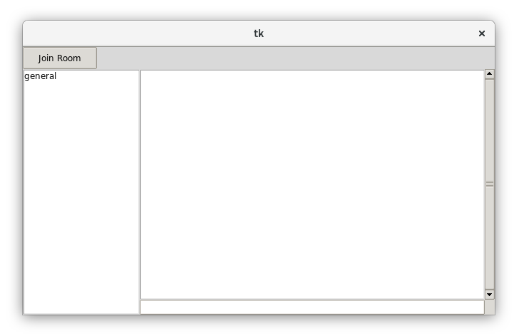

chat
====

Demo application for asyncio, for teaching purposes.

The goal is to show how to build a **non-trivial application**,
since a common (and justified) criticism of many asyncio tutorials
is that they're too simple to be useful for building real-world
applications.

How To Run
----------

Requires Python >= 3.7

#. Open a new terminal, run ``$ python srv.py``
#. Open a new terminal, run ``$ python client.py``
#. Open a *second* new terminal, run ``$ python client.py``

There should be two GUI windows open, and if you type a message
into the bottom edit box and hit ``ENTER``, you should see
the message appear in the other GUI.

Demonstrated Techniques
-----------------------

This is a chat client/server application, perhaps like IRC
or Slack. These are the specific features that are demonstrated
in the demo code:

- server application with many concurrent connections

  + using ``asyncio.start_server()``

- separate client application that connects to the server. Multiple
  client instances can be started.

  + using ``asyncio.open_connection()``
  + handle server outage with a **reconnection** loop

- new asyncio APIs like ``asyncio.run()`` and ``asyncio.create_task``
- Using the **asyncio Streams API**
- decoupling tasks for sending and receiving
- SSL connections

- client application has a Tkinter GUI.

  + show how to run the asyncio loop in a separate thread
  + Tkinter UI loop runs in the main thread
  + This is a similar problem you will encounter with many game
    frameworks

- Signal handling to control shutdown

  + Linux: ``SIGINT`` and ``SIGTERM``
  + **Windows**: ``SIGINT`` (actually ``CTRL-C``) and ``SIGBREAK``

- Keeping track of current connections/clients, using ``weakref``
  containers to make it easier to stay up-to-date.

- Using **queues** in the client UI application to pass data between
  the main thread (UI) and the asyncio thread (IO)

- Creating a **message protocol**, by using a size prefix, and converting
  from the stream bytes to an integer using ``int.frombytes()``

- Passing JSON between client and server

- A Tkinter GUI app that can be sized and maximised

ssl
---

See Doug Hellman's block for how to set up 
the SSL connection. In particular, 
for generating the cert and key:

.. code-block:: bash

    $ openssl req -newkey rsa:2048 -nodes -keyout chat.key \
        -x509 -days 365 -out chat.crt

This creates ``chat.key`` and ``chat.crt`` in the current dir.
